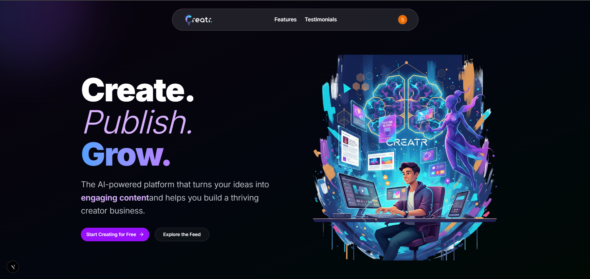

🧠 AI Creator Platform CMS

AI Creator Platform CMS is a full-stack AI-powered content management system built using React 19, Next.js 15, and Tailwind CSS.
It enables creators to manage, generate, and publish AI-assisted content efficiently, featuring integrated authentication, media management, and an intuitive rich-text editor.

🚀 Tech Stack

Frontend: React 19, Next.js 15, Tailwind CSS, Shadcn UI

Backend: Convex (real-time database and API layer)

Authentication: Clerk (Email, Google, GitHub login)

Media Management: ImageKit (AI-powered image & video storage)

Text Editor: React Quill (Rich Text Editor)

⚙️ Features

✅ User authentication and session management with Clerk
✅ AI-powered content creation and management
✅ Real-time CMS backend using Convex
✅ Image and video upload using ImageKit
✅ Rich-text editor for creating and editing posts
✅ Modern UI built with Shadcn components
✅ Fully responsive and optimized for all devices

📸 Project Screenshot

📚 Learnings

Integrating full-stack features using Next.js 15 App Router

Managing real-time data and authentication with Convex and Clerk

Implementing AI-driven media management using ImageKit

Building a production-grade CMS with clean UI and performance optimization

🧩 Tools & Resources

ImageKit

Convex

Clerk Authentication

Coderabbit

# ai-creator-platform
## App Preview

